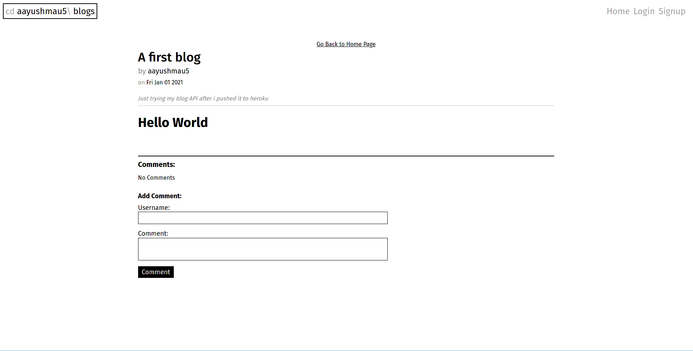
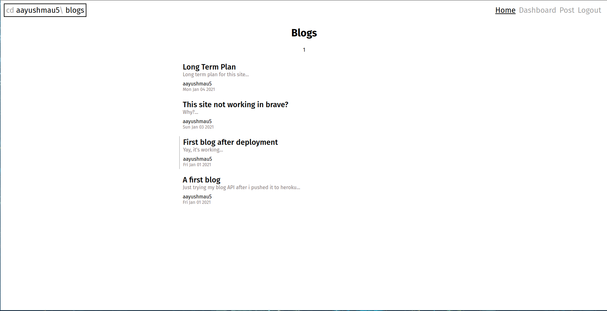
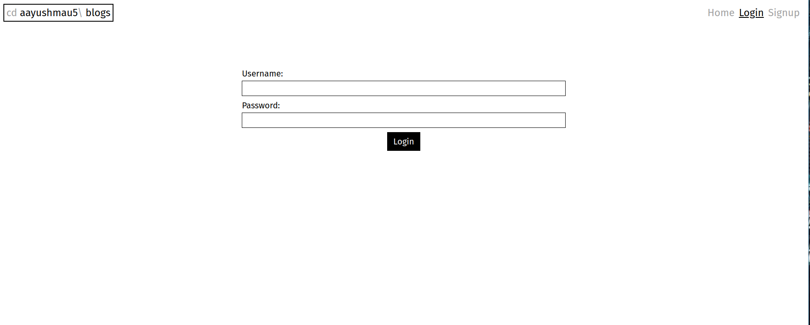
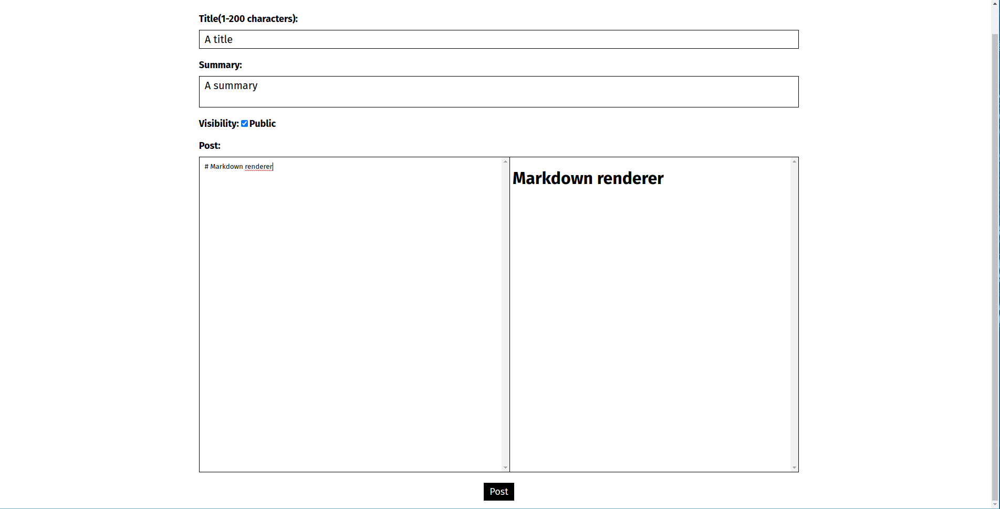
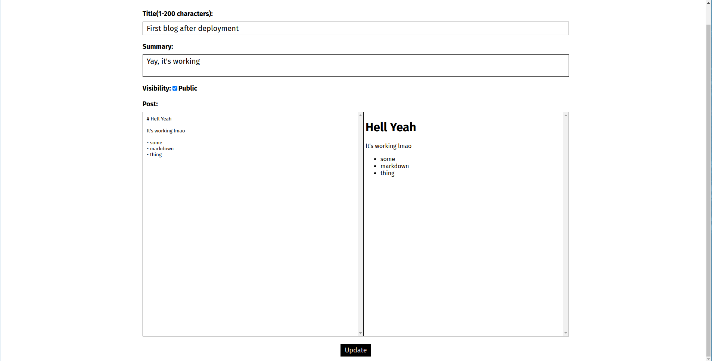

# blog-frontend

Frontend for my RESTful [blog API](https://github.com/aayushmau5/blog-api)

Made using **react**

### Images

#### Blog Page

#### Home page

#### Login Page

#### Dashboard

(After Loggin in)

#### Post Page

(For posting a new blog)

#### Update Page

(For updating a blog)

